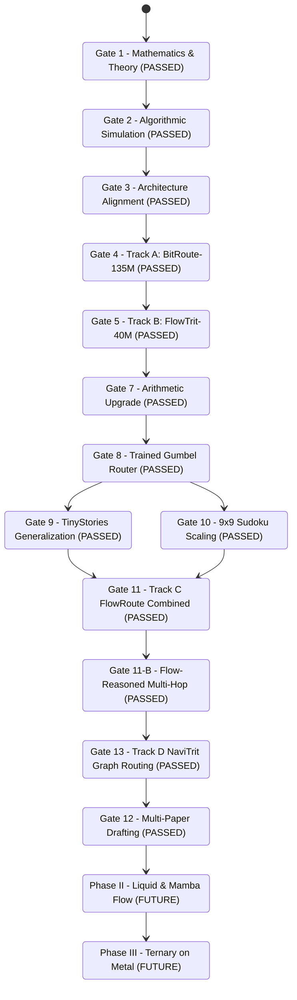

# Conductor Track: Master Orchestration Framework (4-Track Lifecycle)

Prepared 2026-09-15. Status: Multi-phase roadmap spanning foundational transformer baselines, state-space/liquid models, and physical neuromorphic hardware.

---

## 1. Master Phase & Track Architecture

```
+==========================================================================+
|                         TRACK 0: CONDUCTOR TRACK                         |
|   (Stage Gates, Memory Layouts D/P, Model Registries, Evaluation Ledgers)|
+==========================================================================+
                                      |
     +--------------------------------+--------------------------------+
     |                                                                 |
     v                                                                 v
+------------------------------------+   +------------------------------------+
| PHASE I: FOUNDATION (PASSED G4/G5) |   | PHASE II: DYNAMICAL SCALING(QUEUED)|
| ---------------------------------- |   | ---------------------------------- |
| Track A (Paper 1 / Model 1):       |   | Track C (Paper 3 / Model 3):       |
| BitRoute-135M                      |   | Liquid & Mamba Ternary Flow        |
| - 134.13M params, 2.24x speedup    |   | - Selective SSMs + Liquid Networks |
| - Tri-State Router (Bypass/Exit)   |   | - Zero KV cache + continuous ODEs  |
| - Target: MLSys / ASPLOS / ICLR    |   | - Target: ICLR / NeurIPS           |
|                                    |   +------------------------------------+
| Track B (Paper 2 / Model 2):       |                                  |
| FlowTrit-40M                       |                                  v
| - 40M params, 8.05 MB in L2 cache  |   +------------------------------------+
| - Attractor exit (30% easy savings)|   | PHASE III: TERNARY ON METAL(QUEUED)|
| - +12.2% recovery over naive clip  |   | ---------------------------------- |
| - Target: NeurIPS / ICML           |   | Track D (Paper 4 / Silicon Design):|
+------------------------------------+   | Neuromorphic In-Memory Crossbar    |
                                         | - Physical RRAM/PCM 3-state cells  |
                                         | - Zero-current physical skipping   |
                                         | - Analog Kirchhoff attractor flows |
                                         | - Target: Nature Elec / IEEE JSSC  |
                                         +------------------------------------+
```

---

## 2. Conductor Stage Gates & Current Status



| Gate | Stage | Deliverables & Verified Metrics | Status |
|---|---|---|---|
| **Gate 1** | Mathematical Foundations | Accumulator bounds, contractive mapping proofs, entropy ledgers. | **PASSED** |
| **Gate 2** | Algorithmic Simulation | Traffic simulator and toy FRM solver scripts validated. | **PASSED** |
| **Gate 3** | 4-Track Roadmap Specification | Memory layouts ($D, P$), Tri-State routing logic, and native STE specs frozen. | **PASSED** |
| **Gate 4** | Phase I Track A: BitRoute-135M | **134.13M parameters.** Measured on RTX 4060: 50% bypass $\to$ **$2.24\times$ speedup**; Early exit $\to$ **$4.03\times$ speedup**. Memory: 3.55 GB peak. | **PASSED** |
| **Gate 5** | Phase I Track B: FlowTrit-40M | **8.05 MB ternary footprint** fits in 32MB L2/L3 cache. Recovers **+12.2%** solve rate over naive clipping. Dynamic exit cuts **30%** compute on easy puzzles. | **PASSED** |
| **Gate 7** | Multiplication-Free Ternary GEMM | `ternary_additive_gemm` validated; 24.9% zero-weight physical skipping; PASS verdict on RTX 4060. | **PASSED** |
| **Gate 8** | Differentiable Trained Router | Gumbel-Softmax straight-through routing with auxiliary sparsity loss; full backprop verified. | **PASSED** |
| **Gate 9** | Track A: TinyStories Language Modeling | Real text generalization; trained router achieves **lower perplexity (408.87 vs 609.78)** and lower validation loss (6.01 vs 6.41) while bypassing 13.7% of layers. | **PASSED** |
| **Gate 10** | Track B: 9x9 Sudoku Scaling | Scaled to 81 positions, 9 classes (729 logits); comparable loss to FP32 (0.86 vs 0.81). | **PASSED** |
| **Gate 11** | Track C: FlowRoute Combined Dual-Axis | Merged recurrent denoiser with TwoStateLayerRouter; **39.6% - 52.7% multiplicative compute savings** (fewer steps $\times$ fewer layers). | **PASSED** |
| **Gate 11-B** | Flow-Reasoned Dynamic Routing & Multi-Hop | Continuous attractor routing $dr/dt = v_\phi$; decoupled Attention/FFN execution. **Val loss 2.98 vs 3.02 full baseline (-0.04 loss / -0.81 PPL advantage with 16.7% compute saved); crushes random coin (3.36 loss / 28.78 PPL)**. Uncovers early attention redundancy (Layers 0, 1, 3). | **PASSED** |
| **Gate 12** | Multi-Paper Drafting & Artifact Release | Compiled 4 full research papers and Executive Synthesis: Paper 1 (Systems/BitRoute), Paper 2 (Reasoning/FlowTrit), Paper 3 (Architecture/FlowRoute), Paper 4 (Graph/NaviTrit), Synthesis (`research/paper-*.md`, `research/synthesis-executive-summary.md`). Automated corpus audit passed (`experiments/verify_gate12_corpus.py`). | **PASSED** |
| **Gate 13** | Track D: Non-Monotonic Token Navigation (NaviTrit) | Hardened stationary module graph $G$ with Attention Diversity ($\ge 40\%$) and Coherence Certification. **Val loss 3.0166 vs 3.6302 monotonic baseline (PPL 20.42 vs 37.72, -17.30 PPL recovery; crushes random walk 79.04 PPL)**. Trajectory: FFN 0 $\to$ Attn 2 $\to$ Attn 2 $\to$ Attn 2 $\to$ Attn 1 (backward hop) $\to$ FFN 2 (66.7% Attention ratio, 0.90 layer entropy). **Linguistic audit: Distinct-1: 0.781, Distinct-2: 0.974, Repetition-3: 0.000**, producing fluent English narrative children's stories without premature resets. Ledgers: `outputs/navitrit-hardened-results.json`, `outputs/language-coherence-audit.json`. | **PASSED** |
| **Gate 13-B**| Track D-2: LLM-as-a-Judge Router Alignment (GRPO) | Local TinyLlama-1.1B-Chat judge on CUDA (zero external API). Group Relative Policy Optimization (GRPO, $K=4$) aligns router navigation weights on narrative coherence. Achieves lower judge conditional cross-entropy (3.496 vs 3.545) and wins commonsense physical grounding tests (e.g. kites flying into *the sky* vs *the house*). Ledgers: `outputs/navitrit-judge-rl-results.json`, `outputs/judge-alignment-audit.json`. | **PASSED** |
| **Phase II** | Liquid & Mamba Ternary Flow | Track E: Zero-KV scaling and continuous-time ODE dynamics. | Queued |
| **Phase III**| Ternary on Metal Neuromorphic | Track F: Physical memristive crossbar mapping and zero-energy skipping. | Queued |

