# Conductor Track: Master Orchestration Framework (4-Track Lifecycle)

Prepared 2026-09-15. Status: Multi-phase roadmap spanning foundational transformer baselines, state-space/liquid models, and physical neuromorphic hardware.

---

> **Status correction (2026-09-18).** Gates 15-23 accuracy metrics are contaminated (see [`research/hardening-2026-09-18-heldout.md`](hardening-2026-09-18-heldout.md)); Gate 23 had zero training steps. The gate table below is retained as history. New evidence must come from `experiments/unified_scaling/train_navitrit_unified.py` on `data/clean`.

## 1. Master Phase & Track Architecture

```
+==========================================================================+
|                         TRACK 0: CONDUCTOR TRACK                         |
|   (Stage Gates, Memory Layouts D/P, Model Registries, Evaluation Ledgers)|
+==========================================================================+
                                      |
     +--------------------------------+--------------------------------+
     |                                                                 |
     v                                                                 v
+------------------------------------+   +------------------------------------+
| PHASE I: FOUNDATION (PASSED G4/G5) |   | PHASE II: GRAPH ROUTING & SCALING  |
| ---------------------------------- |   | ---------------------------------- |
| Track A (Model 1): BitRoute-135M   |   | Track D (Gates 13-16C): NaviTrit   |
| - 134.13M params, 2.24x speedup    |   | - Non-monotonic graph navigation   |
| Track B (Model 2): FlowTrit-40M    |   | - 100M pretraining + FRP + TTR     |
| - Attractor exit, 8.05 MB in cache |   | - 9.0/10 Python Code (Gate 16-C)   |
+------------------------------------+   +------------------------------------+
                   |                                       |
                   +-------------------+-------------------+
                                       |
                                       v
                     +-----------------------------------+
                     | PHASE II-B: NEXT-GEN EFFICIENCY   |
                     | --------------------------------- |
                     | Track E: Hybrid Mamba SSM (G20)   |
                     | Track G: MoR & LoopFormer (G19)   |
                     | Track H: DTRNet 10% Attn (G18)    |
                     | Track I: MACRO Offline Search(G17)|
                     +-----------------------------------+
                                       |
                                       v
                     +-----------------------------------+
                     | PHASE III: TERNARY ON METAL       |
                     | --------------------------------- |
                     | Track F: Neuromorphic Crossbar    |
                     | - Physical RRAM/PCM 3-state cells |
                     | - Zero-current physical skipping  |
                     | - Target: Nature Elec / IEEE JSSC |
                     +-----------------------------------+
```

---

## 2. Conductor Stage Gates & Current Status

```mermaid
stateDiagram-v2
    Gate1_Math : Gate 1 - Mathematics & Theory (PASSED)
    Gate2_Simulation : Gate 2 - Algorithmic Simulation (PASSED)
    Gate3_Architecture : Gate 3 - Architecture Alignment (PASSED)
    Gate4_ModelA : Gate 4 - Track A: BitRoute-135M (PASSED)
    Gate5_ModelB : Gate 5 - Track B: FlowTrit-40M (PASSED)
    Gate7_Arith  : Gate 7 - Arithmetic Upgrade (PASSED)
    Gate8_Router : Gate 8 - Trained Gumbel Router (PASSED)
    Gate9_Lang   : Gate 9 - TinyStories Generalization (PASSED)
    Gate10_Sud9  : Gate 10 - 9x9 Sudoku Scaling (PASSED)
    Gate11_Route : Gate 11 - Track C FlowRoute Combined (PASSED)
    Gate11B_FlowRoute : Gate 11-B - Flow-Reasoned Multi-Hop (PASSED)
    Gate12_Papers: Gate 12 - Multi-Paper Drafting (PASSED)
    Gate13_NaviTrit: Gate 13 - Track D NaviTrit Graph Routing (PASSED)
    Gate13B_Judge: Gate 13-B - LLM Judge Alignment (PASSED)
    Gate14_NaviTritNM: Gate 14 - Track D-3 NaviTrit-NM Reasoning (PASSED)
    Gate15_Frontier: Gate 15 - Track D-4 Frontier Multi-Corpus Pretraining (PASSED)
    Gate16_FRP: Gate 16 - Track D-5 Frontier LLM Benchmark & FRP (PASSED)
    Gate16B_Dual: Gate 16-B - Track D-6 Hierarchical Dual-Controller (PASSED)
    Gate16C_TTR: Gate 16-C - Track D-7 Branch-and-Collapse TTR (PASSED_BENCHMARKED)
    Gate17_MACRO: Gate 17 - Track I: MACRO Offline Search (PASSED_BENCHMARKED)
    Gate18_DTRNet: Gate 18 - Track H: DTRNet Selective Attention (QUEUED)
    Gate19_LoopFormer: Gate 19 - Track G: MoR & LoopFormer Recurrent Engine (QUEUED)
    Gate20_SSM: Gate 20 - Track E: Hybrid Mamba-Samba-Jamba SSM (PASSED)
    Gate21_Max: Gate 21 - Track F: NaviTrit-Max Scaled 248M (IN_PROGRESS)
    Gate22_Virtual7B: Gate 22 - Track G+E+Scale: Virtual-7B Looped Mamba (PASSED)
    PhaseIII_TrackF : Phase III - Ternary on Metal Neuromorphic (FUTURE)

    [*] --> Gate1_Math
    Gate1_Math --> Gate2_Simulation
    Gate2_Simulation --> Gate3_Architecture
    Gate3_Architecture --> Gate4_ModelA
    Gate4_ModelA --> Gate5_ModelB
    Gate5_ModelB --> Gate7_Arith
    Gate7_Arith --> Gate8_Router
    Gate8_Router --> Gate9_Lang
    Gate8_Router --> Gate10_Sud9
    Gate9_Lang --> Gate11_Route
    Gate10_Sud9 --> Gate11_Route
    Gate11_Route --> Gate11B_FlowRoute
    Gate11B_FlowRoute --> Gate13_NaviTrit
    Gate13_NaviTrit --> Gate13B_Judge
    Gate13B_Judge --> Gate14_NaviTritNM
    Gate14_NaviTritNM --> Gate15_Frontier
    Gate15_Frontier --> Gate16_FRP
    Gate16_FRP --> Gate16B_Dual
    Gate16B_Dual --> Gate16C_TTR
    Gate16C_TTR --> Gate17_MACRO
    Gate17_MACRO --> Gate18_DTRNet
    Gate18_DTRNet --> Gate19_LoopFormer
    Gate19_LoopFormer --> Gate19B_IFMoR
    Gate19_LoopFormer --> Gate19C_Continuation
    Gate19_LoopFormer --> Gate19D_CondProg
    Gate19B_IFMoR --> Gate20_SSM
    Gate19C_Continuation --> Gate20_SSM
    Gate19D_CondProg --> Gate20_SSM
    Gate20_SSM --> Gate21_Max
    Gate21_Max --> Gate22_Virtual7B
    Gate22_Virtual7B --> Gate23_UnifiedMax
    Gate23_UnifiedMax --> PhaseIII_TrackF
```



| Gate | Stage | Deliverables & Verified Metrics | Status |
|---|---|---|---|
| **Gate 1** | Mathematical Foundations | Accumulator bounds, contractive mapping proofs, entropy ledgers. | **PASSED** |
| **Gate 2** | Algorithmic Simulation | Traffic simulator and toy FRM solver scripts validated. | **PASSED** |
| **Gate 3** | 4-Track Roadmap Specification | Memory layouts ($D, P$), Tri-State routing logic, and native STE specs frozen. | **PASSED** |
| **Gate 4** | Phase I Track A: BitRoute-135M | **134.13M parameters.** Measured on RTX 4060: 50% bypass $\to$ **$2.24\times$ speedup**; Early exit $\to$ **$4.03\times$ speedup**. Memory: 3.55 GB peak. | **PASSED** |
| **Gate 5** | Phase I Track B: FlowTrit-40M | **8.05 MB ternary footprint** fits in 32MB L2/L3 cache. Recovers **+12.2%** solve rate over naive clipping. Dynamic exit cuts **30%** compute on easy puzzles. | **PASSED** |
| **Gate 7** | Multiplication-Free Ternary GEMM | `ternary_additive_gemm` validated; 24.9% zero-weight physical skipping; PASS verdict on RTX 4060. | **PASSED** |
| **Gate 8** | Differentiable Trained Router | Gumbel-Softmax straight-through routing with auxiliary sparsity loss; full backprop verified. | **PASSED** |
| **Gate 9** | Track A: TinyStories Language Modeling | Real text generalization; trained router achieves **lower perplexity (408.87 vs 609.78)** and lower validation loss (6.01 vs 6.41) while bypassing 13.7% of layers. | **PASSED** |
| **Gate 10** | Track B: 9x9 Sudoku Scaling | Scaled to 81 positions, 9 classes (729 logits); comparable loss to FP32 (0.86 vs 0.81). | **PASSED** |
| **Gate 11** | Track C: FlowRoute Combined Dual-Axis | Merged recurrent denoiser with TwoStateLayerRouter; **39.6% - 52.7% multiplicative compute savings** (fewer steps $\times$ fewer layers). | **PASSED** |
| **Gate 11-B** | Flow-Reasoned Dynamic Routing & Multi-Hop | Continuous attractor routing $dr/dt = v_\phi$; decoupled Attention/FFN execution. **Val loss 2.98 vs 3.02 full baseline (-0.04 loss / -0.81 PPL advantage with 16.7% compute saved); crushes random coin (3.36 loss / 28.78 PPL)**. Uncovers early attention redundancy (Layers 0, 1, 3). | **PASSED** |
| **Gate 12** | Multi-Paper Drafting & Artifact Release | Compiled 4 full research papers and Executive Synthesis: Paper 1 (Systems/BitRoute), Paper 2 (Reasoning/FlowTrit), Paper 3 (Architecture/FlowRoute), Paper 4 (Graph/NaviTrit), Synthesis (`research/paper-*.md`, `research/synthesis-executive-summary.md`). Automated corpus audit passed (`experiments/verify_gate12_corpus.py`). | **PASSED** |
| **Gate 13** | Track D: Non-Monotonic Token Navigation (NaviTrit) | Hardened stationary module graph $G$ with Attention Diversity ($\ge 40\%$) and Coherence Certification. **Val loss 3.0166 vs 3.6302 monotonic baseline (PPL 20.42 vs 37.72, -17.30 PPL recovery; crushes random walk 79.04 PPL)**. Trajectory: FFN 0 $\to$ Attn 2 $\to$ Attn 2 $\to$ Attn 2 $\to$ Attn 1 (backward hop) $\to$ FFN 2 (66.7% Attention ratio, 0.90 layer entropy). **Linguistic audit: Distinct-1: 0.781, Distinct-2: 0.974, Repetition-3: 0.000**, producing fluent English narrative children's stories without premature resets. Ledgers: `outputs/navitrit-hardened-results.json`, `outputs/language-coherence-audit.json`. | **PASSED** |
| **Gate 13-B**| Track D-2: LLM-as-a-Judge Router Alignment (GRPO) | Local TinyLlama-1.1B-Chat judge on CUDA (zero external API). Group Relative Policy Optimization (GRPO, $K=4$) aligns router navigation weights on narrative coherence. Achieves lower judge conditional cross-entropy (3.496 vs 3.545) and wins commonsense physical grounding tests (e.g. kites flying into *the sky* vs *the house*). Ledgers: `outputs/navitrit-judge-rl-results.json`, `outputs/judge-alignment-audit.json`. | **PASSED** |
| **Gate 14** | Track D-3: NaviTrit-NM Training & Reasoning Track | 45.61M params. Hop-Conditioned Tile Modulation (FiLM $\gamma_t, \beta_t$), Dedicated Recurrent Reasoning Core ($v_{\text{reason}}$), and Hidden-State Contraction Regularization ($\mathcal{L}_{\text{state\_fpf}} < 0.004$). **Val loss 3.1623 vs 4.7900 monotonic baseline (PPL 23.63 vs 120.30, -1.6277 loss win)**. Active reasoning core usage: **2.14 reasoning hops/seq** (trajectory: FFN 0 $\to$ Attn 0 $\to$ Attn 0 $\to$ Reasoning $\to$ Reasoning $\to$ Attn 0, 46.94% Attention ratio). Entity persistence audit: preserved target red ball toy with lower judge loss (2.34 vs 2.59 base model). Ledgers: `outputs/navitrit-nm-results.json`, `outputs/navitrit-nm-coherence-audit.json`. | **PASSED** |
| **Gate 15** | Track D-4: Frontier Scale Multi-Corpus Pretraining | **NaviTrit-10M & 100M validated** on balanced 7.85M token multi-corpus (TinyStories + GSM8K Math + Python Code). **10M scale (11.93M params, 2.3MB packed):** Trained in 306.81s (5.11 min) on RTX 4060; **val loss 0.2214 vs 0.2231 monotonic baseline (PPL 1.25)**, 50% attention ratio, non-monotonic trajectory `[7, 2, 1, 2, 4, 1]`. **100M scale (129.70M params, 27.0MB packed):** Peak VRAM 2.8 GB. Uncovered FFN gravity well on unscaled router (Node 15 / $\text{FFN}_7$ self-loops, 17.55% attention). **Scale-Adaptive Generalization:** Derived $\lambda_{\text{attn\_div}} \propto \sqrt{\mathcal{R}_{\text{dim}} \mathcal{R}_{\text{depth}}} = 1.732$, normalized graph entropy, and topological anti-gravity shield ($\alpha = 1.609$). **Long-Horizon Pretraining (10,000 steps, 20.48M tokens, 28.77 min on RTX 4060):** Smooth monotonic loss decay: $\mathcal{L}_{\text{val}}(2.5\text{k}) = 0.6111 \to \mathcal{L}_{\text{val}}(5\text{k}) = 0.2482 \to \mathcal{L}_{\text{val}}(7.5\text{k}) = 0.1596 \to \mathcal{L}_{\text{val}}(10\text{k}) = \mathbf{0.1355}$ (PPL **1.15**), maintaining **50.2% Attention ratio**. Checkpoints: `outputs/checkpoints/navitrit-100m-step{2500,5000,7500,10000}.pt`. Ledgers: `outputs/navitrit-10m-results.json`, `outputs/navitrit-100m-results.json`, `outputs/navitrit-100m-scale-adaptive-results.json`, `outputs/navitrit-100m-longhorizon-results.json`. | **PASSED** |
| **Gate 16** | Track D-5: Frontier LLM Benchmarking & Flow-Reasoned-Planner (FRP) | Automated LLM-as-a-judge benchmarking suite using **Gemini 2.5 Flash** via OpenRouter across checkpoints (`step2500` vs `step10000`). Demonstrated strong code emergence (**8.5/10**, valid while loop, midpoint calculation, syntax 9.0/10) and narrative progression (1.0 $\to$ 2.0). Diagnosed mathematical reasoning at 1.0/10 due to hallucinated entities and operators ($15 - 3 = 17$). Identified root cause: **Node 24 (Reasoning Core) visitations = 0** due to internal FPF loss penalty asymmetry and lack of domain gating. Formulated the **FRP-Trit Architecture** combining domain/uncertainty gating, persistent entity registers, and continuous fixed-point relaxation. Deep Dives: `research/deep-dives/10-track-d4-frontier-scaling-and-scale-adaptive.md`, `research/deep-dives/11-frp-reasoning-and-frontier-llm-benchmarking.md`. Ledgers: `outputs/navitrit-100m-gemini-benchmark.json`. | **PASSED** |
| **Gate 16-B**| Track D-6: Hierarchical Dual-Controller & Hybrid Verifier Alignment | Decoupled Global Flow Planner ($h_{\text{pool}} \to g_{\text{domain}}, T_{\text{budget}}$) + Local Dynamic Controller (Neural ODE $dr/dt = v_\phi$) + Persistent Entity Registers ($R \in \mathbb{R}^{B \times 4 \times d}$). 600-step GRPO alignment run on RTX 4060 GPU (815.32s, 124.15M backbone frozen). Trajectory autopsy diagnosed Markovian early exit collapse at Hop 3 (`[24, 14, 24, 25]`, 0 FFNs). Blocking early exit restored 8.5/10 code immediately. Deep Dive: `research/deep-dives/12-dual-controller-and-grpo-alignment.md`. Ledgers: `outputs/navitrit-100m-dual-grpo-results.json`. | **PASSED** |
| **Gate 16-C**| Track D-7: Branch-and-Collapse Tree-Traversal Routing (TTR) & Latent Collapse | Parallel Top-2 branch dispatch ($D=3$ tree levels = 6 tile executions in 3 kernel intervals). Enforces **Parallel Transformer Invariant** (Branch 1 = Sequence Mixing [Attn $0..11$ + Reasoning Core 24], Branch 2 = Channel Mixing [FFN $0..11$]) with **neutral, unbiased exploration**. Latent Collapse Operator unifies branches into $\mathbf{h}_{t+1}$ with linear $O(S \cdot d)$ KV-cache. **Official Gemini 2.5 Flash Benchmark:** Python Code Synthesis reached **9.0/10 (All-Time Project High)**, Story **2.5/10**, Composite **4.17/10 (All-Time High)**. 600 steps in 866.79s on RTX 4060 GPU. Checkpoint: `outputs/checkpoints/navitrit-100m-tree-grpo.pt`. Ledgers: `outputs/navitrit-100m-tree-grpo-results.json`, `outputs/navitrit-100m-gemini-benchmark.json`. Specification: `research/navitrit-tree-architecture-handoff.md`. Deep Dive: `research/deep-dives/13-tree-traversal-and-latent-collapse.md`. | **PASSED_BENCHMARKED** |
| **Gate 17** | Phase II Track I: MACRO Offline Search & Graph-of-Traversals Routing | In-place evolution from static offline sub-graphs to dynamic Graph-of-Traversals (`NaviTritGraphForCausalLM`, 100% parameter-compatible with `navitrit-100m-tree-grpo.pt`). Generates scored directed traversal graphs with continuous edge weights $w_{u \to v}$. Bipartite CEM search achieved **2.83 PPL on Python code** (-52.6% vs baseline) and **5.16 PPL on GSM8K math** (-52.5% vs baseline). Gemini 2.5 Flash Benchmark: **9.0/10 Code (`CORRECT`)**, matching top performance while logging full traversal graphs. Ledgers: `outputs/macro-routes.json`, `outputs/navitrit-100m-gemini-benchmark.json`. Deep Dive: `research/deep-dives/14-macro-offline-route-discovery.md`. | **PASSED_BENCHMARKED** |
| **Gate 18** | Phase II Track H: DTRNet Selective Attention Gating & Token Graph Routing | Dedicated token-level routing controller emitting gating tensors $[B, S, 2]$. Enforces the **Channel-Mixing Invariant** ($w_{\text{chan}} \ge 0.50$, preventing zero-FFN collapse) and modulates sequence attention via per-token saliency $s_{b, i} \in [0, 1]$. Re-converges representations through `TokenGraphCollapseOperator`. **Gemini 2.5 Flash Benchmark:** Python Code **9.0/10 (`CORRECT`)**, Composite **4.17/10**, zero backbone drift (`SHA256: B13102713...`). Checkpoint: `outputs/checkpoints/navitrit-100m-token-graph-grpo.pt`. Ledgers: `outputs/navitrit-100m-token-graph-grpo-results.json`, `outputs/navitrit-100m-gemini-benchmark.json`. Deep Dive: `research/deep-dives/15-token-level-graph-routing-dtrnet.md`. | **PASSED_BENCHMARKED** |
| **Gate 19** | Phase II Track G: Mixture-of-Recursions (MoR) & LoopFormer | Consolidates 12 transformer layers into a single **7.09M parameter-shared super-block** (1.689 MB packed in 1.58-bit, **5.28% of 32MB L2 cache**, zero DRAM weight-fetching traffic during recurrent loops). Implemented **2D Recursion-Wise KV Cache** $(\mathbf{K}_{t, k}, \mathbf{V}_{t, k})$ with verified $10^{-6}$ numerical equivalence and shortcut-consistency training across compute budgets $M \in \{2, 4, 6\}$. **Final Multi-Corpus Perplexity: 1.12 ($M=2, 4$), 1.13 ($M=6$), 1.14 ($M=8$)**. **Official Gemini 2.5 Flash Benchmark: Overall 4.58/10 (ALL-TIME PROJECT RECORD)**, Story **3.75/10 (Project Record)**, Code **8.5/10 (`PARTIALLY_CORRECT`)**. Checkpoint: `outputs/checkpoints/navitrit-100m-loopformer.pt`. Ledgers: `outputs/navitrit-100m-loopformer-results.json`, `outputs/navitrit-100m-gemini-benchmark.json`. Deep Dive: `research/deep-dives/16-mixture-of-recursions-and-loopformer.md`. | **PASSED_BENCHMARKED** |
| **Gate 19-B**| Phase II Track G-Extended: Interleaved Functional Mixture-of-Recursions (IF-MoR) | Widens super-block to **20.62M parameters** (4.915 MB packed, **20.48% of 24MB L2 Cache**, zero DRAM traffic). Interleaved 4 branches: Full Attention, Linear Attention, Ternary Mamba SSM ($s_t \in \mathbb{R}^{64}$ scratchpad), and Wide SwiGLU FFN ($d_{\text{ff}} = 4096$). Autopsy: Initial 100 steps trained smoothly (val loss 2.0458, balanced branches). At Step 150-200, unconstrained recurrent Mamba state compounded exponentially ($s_t$ norm exploded to $2.78 \times 10^7$, loss $7.21 \times 10^{11}$), collapsing the router into 99.9% Mamba and disrupting vocabulary projection. Ledgers: `outputs/navitrit-100m-ifmor-results.json`, `outputs/ifmor-static-state-analysis-report.json`, `outputs/navitrit-100m-gemini-benchmark.json`. Deep Dive: `research/deep-dives/17-interleaved-functional-mor-and-state-tracking.md`. | **AUTOPSIED** |
| **Gate 19-C**| Phase II Track S: Continuation Calculus & Static State Analysis | Formalizes MoR recurrence as CPS runtime interpreter with Reynolds defunctionalized KV continuation store, Girard linear logic registers, and per-token $\text{call/cc}$ exit routing. Proven with Lamport TLA+ specs (`mor_continuation.tla`, `arithmetic_continuation.tla`). Static analysis verified **Banach contraction ($L = 0.8007 < 1.0$)**, empirical contraction factor **$\rho = 0.9729 < 1.0$**, and directional collinearity alignment ($0.9987$ cosine similarity at $k=4$). Deep Dive: `research/deep-dives/18-continuation-calculus-and-static-state-analysis.md`. Ledgers: `outputs/static-state-analysis-report.json`. | **PASSED_VERIFIED** |
| **Gate 19-D**| Phase II Track W: Dynamic Weight Parameterization & Conditional Programs | Formulates weights as conditional programs $W_v(\mathbf{c}_t) = \mathbf{W}_{\text{base}} + \Delta \mathbf{W}(\mathbf{c}_t)$. Resolves the Weight Identity Crisis with ContextHyperNet FiLM modulation, low-rank dynamic adapters ($r=16$), functional role typing (BIND, REFINE, VERIFY, EMIT), and PCGrad gradient surgery. Proven with TLA+ (`conditional_program_weights.tla`). Unit tests 5/5 passed on CUDA with exact zero-drift identity initialization ($\max \Delta = 0.00$). Trained in 97.94s on RTX 4060 GPU, achieving **validation perplexity 2.14 at $M=4$ (Loss 0.7630)** and **2.41 at $M=2$ (Loss 0.8811)**. Static state analysis verified **Banach contractivity ($L = 0.8018 < 1.0$)**, zero representation explosion, and 100% active channel modulation across roles. Official Gemini 2.5 Flash Benchmark: Overall **1.5/10**, Story **2.5/10**, Code **1.0/10**, Math **1.0/10** (syntactically coherent code and stories produced; highlights need for extended step training of the 234K modulators). Deep Dive: `research/deep-dives/19-dynamic-weight-parameterization-and-conditional-programs.md`. Checkpoint: `outputs/checkpoints/navitrit-100m-condprog.pt`. Ledgers: `outputs/navitrit-100m-condprog-results.json`, `outputs/condprog-static-state-analysis-report.json`, `outputs/navitrit-100m-gemini-benchmark.json`. | **PASSED_BENCHMARKED** |
| **Gate 19-D2**| Phase II Track W+G: Looped Dynamic Weight Parameterization (Looped-DWP) | Merged LoopFormer parameter-shared recurrence with rank $r=32$ ContextHyperNet and FiLM modulators. Warm-started with exact zero-drift identity from `navitrit-100m-loopformer.pt` ($\max \Delta = 4.17 \times 10^{-7}$). 100% of base weights frozen ($!W$, SHA-256 protected). Trained for 2,500 steps (829.51s, 13.83 min) on RTX 4060 GPU with PCGrad gradient surgery. **Validation Perplexity:** $M=1$: **2.06**, $M=2$: **1.15**, $M=4$: **1.12** (matches LoopFormer record), $M=6$: **1.12**, $M=8$: **1.14**. Static state analysis verified **Banach contractivity ($L = 0.7348 < 1.0$)**, empirical contraction factor **$\bar{\rho} = 0.9343 < 1.0$**, and bounded norm convergence ($20.61 \to 73.96$). **Official Gemini 2.5 Flash Benchmark: Overall 4.0/10**, Python Code **8.5/10 (`PARTIALLY_CORRECT`)**, Story **2.5/10**, Math **1.0/10**. Recurrent engine occupies **1.944 MB packed (8.10% of 24MB L2 cache)** with ZERO off-chip DRAM weight traffic. Checkpoint: `outputs/checkpoints/navitrit-100m-looped-dwp.pt`. Ledgers: `outputs/navitrit-100m-looped-dwp-results.json`, `outputs/looped-dwp-static-state-analysis-report.json`, `outputs/navitrit-100m-gemini-benchmark.json`. Deep Dive: `research/deep-dives/20-looped-dynamic-weight-parameterization.md`. | **PASSED_BENCHMARKED** |
| **Gate 20** | Phase II Track E: Hybrid Mamba-Samba-Jamba SSM | Linear $O(S)$ selective SSM layers interleaved with ternary attention ($1:3$ ratio). Discretized via ZOH with contractive bound $|\bar{\mathbf{A}}| < 1.0$ (eliminating the Gate 19-B explosion trap). Slashes active KV cache by $4.0\times$. Unit tests: 5/5 PASSED on CUDA. Records: `experiments/mamba/ternary_mamba_block.py`, `experiments/mamba/hybrid_mamba_model.py`, `experiments/mamba/test_ternary_mamba.py`. | **VALIDATED** |
| **Gate 21** | Phase II Track F: NaviTrit-Max Scaled Architecture & Agro-Environmental Pretraining | **Maxed-Out Scaling to 247.6M parameters** within 8.58GB VRAM envelope ($d=1024, d_{\text{ffn}}=4096, 6 \text{ layers}, 16 \text{ heads}$). Wide Dual-Expert Routing Block (General Language + Crop Science & Environmental General Knowledge SwiGLU experts, $2 \times 4096 = 8192$ capacity). Multi-scale sequence mixing (Flash SDPA Attention + Causal 1D Depthwise ConvMixer). Unit tests: 5/5 PASSED on CUDA in 3.06s. Peak training VRAM measured at 7.44 GB (1.14 GB safety headroom). 20-step dry run: loss $11.01 \to 9.65$. Balanced 25M-token pretraining corpus engineered for LLM general knowledge. Checkpoints: `outputs/checkpoints/navitrit-max-best.pt`, `outputs/checkpoints/navitrit-max-latest.pt`. Deep Dive: `research/deep-dives/21-navitrit-max-scaled-hybrid-architecture.md`. | **VERIFIED_READY_FOR_TRAINING** |
| **Gate 22** | Phase II Track G+E+Scale: Virtual-7B Looped-Mamba & Purchased Solutions Scaling | **Virtual-7B Scaled Hybrid Looped Architecture** ($N_{\text{physical}} = 560.32\text{M}$ parameters, 32 virtual layers, $\approx 42\text{ GFLOPs/token}$). Parameter-shared 4-macro-layer super-block ($85.14\text{ MB}$ packed ternary) looped across $T=8$ recursions. Multi-scale sequence mixing (Ternary Selective Mamba SSM + Flash SDPA Attention + Dual-Expert SwiGLU: General Logic + Agro-Environmental Science). Dynamic Weight Parameterization via ContextHyperNet (rank $r=64$, 8 functional roles). Contractive ZOH stability mathematically guaranteed ($|\bar{\mathbf{A}}| < 1.0$). Unit tests: 3/3 PASSED on CUDA. Complete cloud rental and hardware purchase economics audited: RunPod 8x RTX 4090 ($5.52/hr, ~$348 for 10B tokens) / Lambda 1x H100 SXM ($3.29/hr, ~$240 for 10B tokens); Dual used RTX 3090 NVLink ($1,500 total CapEx, 48GB VRAM, $0/mo ongoing). Deep Dive: `research/deep-dives/22-virtual-7b-hybrid-looped-mamba-and-scaling-economics.md`. Records: `experiments/virtual_7b/hybrid_looped_mamba_virtual7b.py`, `experiments/virtual_7b/test_virtual7b_scaling.py`. | **VALIDATED_TESTS_PASSED** |
| **Gate 23** | Phase II Track U: Unified Frontier Scaling & Hardware Expansion | **NaviTrit-Unified-Graph-DWP-Max** ($N_{\text{physical}} = 203.87\text{M}$ parameters, 24 virtual layers, $\approx 32\text{ GFLOPs/token}$). Unified parameter-maximized synthesis of all project breakthroughs: Non-monotonic graph of traversals, Dynamic Weight Parameterization (Looped-DWP for forward/backward/skip roles), Contractive ZOH Mamba SSM ($|\bar{\mathbf{A}}| < 1.0$), Flash SDPA Attention, and Dual-Expert SwiGLU (General Logic + Agro-Environmental Science). Anti-gravity well invariant ($w_{\text{chan}} \ge 0.50$) permanently prevents router entrapment. 5/5 unit tests PASSED on CUDA. Balanced 25M-token corpus compiled (`multicorpus_unified_25m.pt`: 52% General Reasoning, 48% Agro-Environmental Science). Training engine primed and verified without launching. Desktop PC hardware expansion roadmap detailed for Gigabyte B760 motherboard. Deep Dive: `research/deep-dives/23-navitrit-unified-graph-dwp-and-hardware-scaling.md`. Records: `experiments/unified_scaling/navitrit_unified_model.py`, `experiments/unified_scaling/test_navitrit_unified.py`, `experiments/unified_scaling/train_navitrit_unified.py`. | **VALIDATED_TESTS_PASSED** |
| **Phase III**| Track F: Ternary on Metal Neuromorphic | Physical memristive crossbar mapping, zero-energy in-memory computing, and Kirchhoff attractor relaxation. | **QUEUED** |

