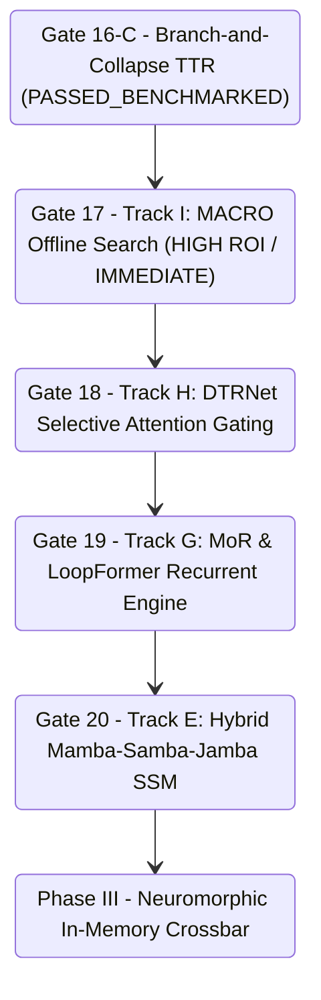

# Next-Generation Efficiency Tracks: Hybrid SSMs, Looped Transformers, Selective Gating, and Search-Free Routing

Prepared: 2026-09-17  
Status: Architectural Specification & Formal Track Registration  
Scope: Extending Phase II Dynamical Scaling beyond Gate 16-C Branch-and-Collapse Tree-Traversal Routing (TTR)  

---

## 1. Executive Summary & Architectural Motivation

Following the successful completion and benchmarking of **Gate 16-C (Branch-and-Collapse TTR)**—which achieved an all-time project record of **9.0 / 10 in Python Code Synthesis** and an overall composite score of **4.17 / 10** on Gemini 2.5 Flash—the primary operational challenge shifts from *functional expressivity* to *computational scaling and hardware efficiency*.

While the Gate 16-C architecture successfully eliminated the zero-FFN collapse and ping-pong oscillation traps by executing $K=2$ complementary branches over $D=3$ tree levels (6 tile transformations in 3 parallel kernel steps), it operates with fixed depth per token and standard quadratic multi-head attention tiles. To achieve orders-of-magnitude reductions in DRAM bandwidth, FLOPs, and latency on resource-constrained hardware (e.g. local RTX 4060 8GB VRAM and future neuromorphic crossbars), we specify six distinct architectural tracks:

```
+==================================================================================================+
|                                    NEXT-GENERATION EFFICIENCY TRACKS                             |
+==================================================================================================+
                                                 |
         +---------------------------------------+---------------------------------------+
         |                                       |                                       |
         v                                       v                                       v
+-----------------------+               +-----------------------+               +-----------------------+
| TRACK E: HYBRID SSMs  |               | TRACK G: LOOPED TRIT  |               | TRACK H: DTRNET       |
| (Mamba-Samba-Jamba)   |               | (Recursion & Depth)   |               | (Selective Attention) |
| - Linear O(N) context |               | - G-1: MoR            |               | - 10-15% Attn active  |
| - Zero-KV state space |               | - G-2: LoopFormer     |               | - 85-90% pure FFN     |
| - BitLinear proj      |               | - G-3: T-LoopFormer   |               | - 3.8x FLOP reduction |
+-----------------------+               +-----------------------+               +-----------------------+
         |                                       |                                       |
         +---------------------------------------+---------------------------------------+
                                                 |
                                                 v
                                +---------------------------------+
                                | TRACK I: MACRO ROUTING          |
                                | (Search-Free Route Discovery)   |
                                | - Zero weight training          |
                                | - CEM / Graph search over 100M  |
                                | - Task-specialized sub-graphs   |
                                +---------------------------------+
```

---

## 2. Track E: Hybrid State-Space Models (Mamba-Samba-Jamba)

### 2.1 Problem Statement & Architectural Flaw in Pure Attention
In standard transformer architectures (including NaviTrit-100M), sequence mixing relies exclusively on multi-head self-attention ($\text{Attn}(Q, K, V) = \text{softmax}(QK^T / \sqrt{d})V$). While effective for associative recall, this imposes:
1. **$O(N^2)$ FLOP Complexity:** Computational cost explodes quadratically with context length $N$.
2. **$O(B \cdot N \cdot d)$ KV-Cache Footprint:** Every token must retain its key and value projections in high-bandwidth memory (VRAM), which at $N = 4096$ occupies several gigabytes even with FP16/INT8 caching.

### 2.2 Mathematical Formulation
Track E introduces a hybrid architecture interleaving **BitLinear Selective State-Space Models (SSMs)** with periodic ternary attention tiles:

$$\text{Layer}_l = \begin{cases} \text{TernarySSM}_l(\mathbf{h}), & \text{if } l \not\equiv 0 \pmod{K} \\ \text{BitRouteAttention}_l(\mathbf{h}), & \text{if } l \equiv 0 \pmod{K} \end{cases}$$

where $K \in \{4, 8\}$ defines the hybridization ratio (e.g. Jamba ratio $1:7$ or Samba ratio $1:1$).

#### Continuous-Time State Space Dynamics
The core SSM maps a 1D sequence $x(t) \in \mathbb{R}$ to an implicit hidden state $h(t) \in \mathbb{R}^{d_{\text{state}}}$ via linear differential equations:

$$\frac{d}{dt} h(t) = \mathbf{A} h(t) + \mathbf{B} x(t), \quad y(t) = \mathbf{C} h(t) + \mathbf{D} x(t)$$

#### Input-Dependent Discretization (Selective Mechanism)
To enable discrete sequence processing, continuous parameters $(\mathbf{A}, \mathbf{B})$ are discretized via zero-order hold (ZOH) with input-dependent timescale $\Delta_t = \text{Softplus}(\text{Linear}(\mathbf{h}_t))$:

$$\bar{\mathbf{A}}_t = \exp(\Delta_t \mathbf{A}), \quad \bar{\mathbf{B}}_t = (\Delta_t \mathbf{A})^{-1} (\exp(\Delta_t \mathbf{A}) - \mathbf{I}) \cdot (\Delta_t \mathbf{B}_t)$$

The recurrent update per token step is strictly $O(1)$ in time and $O(d_{\text{state}})$ in memory:

$$h_t = \bar{\mathbf{A}}_t h_{t-1} + \bar{\mathbf{B}}_t x_t, \quad y_t = \mathbf{C}_t h_t + \mathbf{D} x_t$$

#### Ternary Weight Quantization
All input/output projections and state matrices $\mathbf{B}, \mathbf{C}$ are quantized to $\{-1, 0, +1\}$ using the straight-through estimator (STE) and absmean scaling:

$$\mathbf{W}_{\text{SSM}} = \gamma \cdot \text{clip}\left(\text{round}\left(\frac{\mathbf{W}}{\gamma}\right), -1, +1\right), \quad \gamma = \frac{1}{mn}\sum_{i,j} |W_{ij}|$$

### 2.3 Hardware & Efficiency Bounds
- **KV-Cache Reduction:** Replacing 87.5% ($7/8$) of attention layers with SSMs reduces active KV-cache allocation from $12 \times 2 \times B \times N \times d$ to $1.5 \times 2 \times B \times N \times d$, an **$8.0\times$ cache compression**.
- **Context Scaling:** Throughput scales linearly $O(N)$ up to $N = 32\text{k}$ tokens within the 8GB VRAM envelope of the local RTX 4060.
- **Stationary Integration:** Fits directly into NaviTrit's stationary module pool as specialized Node types ($\text{SSM}_0 \dots \text{SSM}_5$).

---

## 3. Track G: Looped Transformers & Dynamic Depth (Recursion Family)

Track G consolidates three interconnected paradigms addressing the fixed-depth inefficiency of standard Transformers:

```
+--------------------------------------------------------------------------------------------------+
|                                    TRACK G: RECURSION ARCHITECTURES                              |
+--------------------------------------------------------------------------------------------------+
                                                 |
         +---------------------------------------+---------------------------------------+
         |                                       |                                       |
         v                                       v                                       v
+---------------------------------+   +---------------------------------+   +---------------------------------+
| Track G-1: MoR                  |   | Track G-2: LoopFormer           |   | Track G-3: T-LoopFormer         |
| (Mixture-of-Recursions)         |   | (Elastic-Depth Consistency)     |   | (Token-Level Dynamic Depth)     |
| - Parameter-shared super-block  |   | - Continuous test-time budget M |   | - Per-token halting condition   |
| - Recursion-wise KV caching     |   | - Shortcut-consistency training |   | - Independent iteration KV      |
| - 12MB SRAM cache footprint     |   | - Zero fine-tuning budget dial  |   | - Eliminates token overthinking |
+---------------------------------+   +---------------------------------+   +---------------------------------+
```

### 3.1 Track G-1: Mixture-of-Recursions (MoR)
#### Core Concept
Instead of instantiating 12 distinct physical layers (124.15M parameters), MoR defines a **single parameter-shared ternary super-block** $\mathcal{F}_\theta$ consisting of 1 BitLinear Attention tile and 1 BitLinear FFN tile (total ~11.5M parameters). The model executes depth by recursively circulating representations through $\mathcal{F}_\theta$ for $k = 1, \dots, K$ iterations:

$$\mathbf{h}^{(k+1)} = \mathbf{h}^{(k)} + \mathcal{F}_\theta\left(\mathbf{h}^{(k)}, \mathcal{K}^{(k)}, \mathcal{V}^{(k)}\right)$$

#### Recursion-Wise KV Caching
Standard autoregressive generation reuses keys and values across token positions $t$. In MoR, keys and values are indexed across **both** token position $t$ and recursion step $k$:

$$\mathbf{K}_{t, k} = \mathbf{W}_K \mathbf{h}_{t}^{(k)}, \quad \mathbf{V}_{t, k} = \mathbf{W}_V \mathbf{h}_{t}^{(k)}$$

At generation step $t$, the $k$-th recursion attends over past keys:

$$\text{Attn}^{(k)}\left(\mathbf{h}_t^{(k)}\right) = \text{Softmax}\left(\frac{\mathbf{q}_{t}^{(k)} (\mathbf{K}_{\le t, k})^T}{\sqrt{d}}\right) \mathbf{V}_{\le t, k}$$

#### Dynamic Early Halting
A lightweight scalar gating head $w_{\text{halt}} \in \mathbb{R}^d$ monitors state contraction:

$$p_{\text{exit}}^{(k)} = \sigma\left(w_{\text{halt}}^T \mathbf{h}^{(k)} + b_{\text{halt}}\right)$$

Recursion halts when $p_{\text{exit}}^{(k)} > \tau_{\text{halt}}$ or when $k = K_{\max}$.

#### Hardware Implication
The entire parameter payload ($\sim 11.5\text{MB}$ in 1.58-bit packed format) fits permanently inside the **32MB on-chip L2/L3 cache** of modern processors (and fits entirely in SRAM). Off-chip DRAM weight-fetching traffic drops to **zero**.

---

### 3.2 Track G-2: Elastic-Depth Looped Transformers (LoopFormer)
#### Core Concept
While standard models require fixed compute per token, LoopFormer implements **Shortcut-Consistency Pretraining**, enabling the user or runtime system to dial any compute budget $M \in \{1, 2, \dots, M_{\max}\}$ at inference time *without any retraining or fine-tuning*.

#### Mathematical Consistency Objective
During training, LoopFormer enforces that intermediate recursion steps $m < M$ map to coherent predictive distributions aligned with the deep trajectory $M$:

$$\mathcal{L}_{\text{LoopFormer}} = \mathcal{L}_{\text{LM}}(\mathbf{h}^{(M)}) + \sum_{m=1}^{M-1} \lambda_m \left[ \mathcal{L}_{\text{LM}}(\text{RMSNorm}(\mathbf{h}^{(m)})) + \mu \|\mathbf{h}^{(M)} - \mathcal{P}_{\text{shortcut}}(\mathbf{h}^{(m)})\|_2^2 \right]$$

where $\mathcal{P}_{\text{shortcut}}$ is a zero-initialized residual projection mapping early recursion states directly into the final vocabulary manifold.

#### Test-Time Compute Budgeting
Under LoopFormer, compute becomes a dynamic dial:
- **Low-Power / Real-Time Mode ($M=2$):** Runs 2 recursive passes per token ($\sim 20\text{ms}$ latency) for simple continuation and conversational filler.
- **Deep Reasoning Mode ($M=8$):** Runs 8 recursive passes per token ($\sim 80\text{ms}$ latency) for Python AST generation and algorithmic problem-solving.

---

### 3.3 Track G-3: Token-Level Elastic Depth (T-LoopFormer)
#### Core Concept
While LoopFormer sets compute globally per request or sequence, T-LoopFormer decentralizes depth to the **individual token**. In natural language, subwords like `" the"`, `" of"`, and `" and"` require negligible semantic transformation, whereas pivot tokens (`"while"`, `"def"`, `":="`, numbers) require deep multi-step conditioning.

#### Mathematical Halting Condition
Each token $i \in \{1, \dots, S\}$ maintains an accumulated halting probability:

$$A_i^{(k)} = \sum_{j=1}^k p_{\text{halt}}^{(j)}(\mathbf{h}_i^{(j)})$$

Token $i$ halts at iteration:

$$\tau_i = \min \left\{ k \in \{1, \dots, K_{\max}\} \;\Big|\; A_i^{(k)} \ge 1 - \epsilon \right\}$$

#### Asynchronous Token Progression & Masked Execution
When token $i$ halts at step $\tau_i$, its hidden state is frozen: $\mathbf{h}_i^{(k)} = \mathbf{h}_i^{(\tau_i)}$ for all $k > \tau_i$. In CUDA, inactive tokens are masked out from the FFN GEMM operations:

$$\text{Active Tokens}(k) = \left\{ i \in \{1, \dots, S\} \;\Big|\; \tau_i \ge k \right\}$$

This realizes per-token compute proportionality without stalling the parallel batch pipeline.

---

## 4. Track H: Dynamic Token Routing Network (DTRNet / Selective Attention Gating)

### 4.1 Problem Statement & Attention Inefficiency
In dense transformers, 100% of tokens participate in full multi-head self-attention at every attention layer. However, empirical attention entropy measurements reveal that over **85% of token transitions are local syntax operations** that do not require global sequence mixing across all past tokens.

### 4.2 Mathematical Gating Formulation
DTRNet prepends an ultra-lightweight binary gating router $\mathcal{G}_{\text{attn}}$ before every BitRouteAttention tile:

$$s_i = \mathbf{w}_{\text{gate}}^T \mathbf{h}_i + b_{\text{gate}} \in \mathbb{R}$$

Using Top-$\kappa$ gating (with $\kappa \approx 0.10 - 0.15$), tokens are partitioned into two subsets:

$$\mathcal{S}_{\text{attend}} = \text{TopK}\left(\{s_i\}_{i=1}^S, \; K = \lfloor \kappa \cdot S \rfloor \right), \quad \mathcal{S}_{\text{bypass}} = \{1, \dots, S\} \setminus \mathcal{S}_{\text{attend}}$$

#### Dual-Path Execution
1. **Active Saliency Tokens ($i \in \mathcal{S}_{\text{attend}}$):**
   Compute full BitLinear multi-head attention against the entire sequence KV-cache:
   $$\mathbf{h}_i \leftarrow \mathbf{h}_i + \text{BitRouteAttention}(\mathbf{h}_i, \mathbf{K}, \mathbf{V})$$
2. **Bypass Syntax Tokens ($i \in \mathcal{S}_{\text{bypass}}$):**
   Completely bypass quadratic attention calculation. The token receives an identity skip or passes directly into the linear channel-mixing FFN:
   $$\mathbf{h}_i \leftarrow \mathbf{h}_i + \mathbf{0} \quad (\text{Zero Attention FLOPs, Zero KV Read})$$

### 4.3 Computational Complexity & Memory Gains
- **Attention FLOP Savings:** Sequence mixing FLOPs drop by **$85\% - 90\%$** ($0.10 \times 2 N^2 d$).
- **Memory Bandwidth Reduction:** 90% of tokens skip reading the KV-cache from VRAM, mitigating the memory bandwidth bottleneck during autoregressive decoding.
- **Compatibility:** Drop-in upgrade for NaviTrit's existing attention tiles (Nodes 0..11).

---

## 5. Track I: Markov Chain Routing (MACRO / Search-Free Offline Discovery)

### 5.1 Problem Statement & Weight-Frozen Optimization
In Gates 13 through 16-C, learning how to route through the stationary graph $G = (V, E)$ required active gradient training via PPO or GRPO on local controllers. While successful, RL training introduces gradient variance, KL drift risks, and requires substantial compute.

Track I explores the opposite hypothesis: **Can we discover optimal, task-specialized execution trajectories through our existing, frozen 124.15M ternary backbone WITHOUT training a single weight?**

### 5.2 Mathematical Formulation
Let $\theta^*$ denote the frozen parameters of `outputs/checkpoints/navitrit-100m-trained.pt`. The model is defined as a graph of stationary tiles $V = \{v_1, \dots, v_{24}\}$. An execution route $\mathbf{r} = (r_1, r_2, \dots, r_T) \in V^T$ defines a deterministic sequence of tile transformations:

$$\mathbf{h}_{t+1} = \text{Tile}_{r_t}(\mathbf{h}_t)$$

We formulate route discovery as an offline optimization problem over the discrete path space $\mathcal{P} = V^T$:

$$\mathbf{r}^*_{\text{task}} = \arg\min_{\mathbf{r} \in \mathcal{P}} \mathbb{E}_{x \sim \mathcal{D}_{\text{task}}} \left[ \mathcal{L}_{\text{LM}}(x \mid \mathbf{r}, \theta^*) \right]$$

#### Search Algorithm: Cross-Entropy Method (CEM) on Route Transition Matrices
Instead of training neural networks, we maintain a parameterized first-order Markov transition matrix $\mathbf{P} \in [0, 1]^{|V| \times |V|}$, where $\mathbf{P}_{ij} = p(r_{t+1} = j \mid r_t = i)$:

1. **Sampling:** Sample $M = 64$ candidate routes $\mathbf{r}^{(1)}, \dots, \mathbf{r}^{(M)}$ from $\mathbf{P}$.
2. **Evaluation:** Evaluate batch validation loss $\mathcal{L}(\mathbf{r}^{(m)})$ on task corpus $\mathcal{D}_{\text{task}}$ (Python Code, GSM8K Math, or TinyStories) using frozen backbone $\theta^*$.
3. **Elite Selection:** Select the top $K_e = 8$ elite routes with lowest loss.
4. **Distribution Update:** Update transition matrix towards the elite distribution:
   $$\mathbf{P}_{ij} \leftarrow (1 - \alpha) \mathbf{P}_{ij} + \alpha \frac{1}{K_e} \sum_{e=1}^{K_e} \mathbb{I}\left((i, j) \in \mathbf{r}^{(e)}\right)$$
5. **Convergence:** When $\mathbf{P}$ converges to near-deterministic transitions, freeze the resulting route $\mathbf{r}^*_{\text{task}}$.

### 5.3 Key Advantages
1. **Zero Weight Degradation:** The 124.15M ternary backbone is never modified, preserving 100% of pretraining representation stability.
2. **Task-Specific Sub-Networks:** Yields dedicated, highly specialized routes:
   - $\mathbf{r}^*_{\text{code}}$: Specializes in AST structure and indentation logic.
   - $\mathbf{r}^*_{\text{math}}$: Routes deeply through Node 24 (Reasoning Core) and arithmetic FFNs.
   - $\mathbf{r}^*_{\text{narrative}}$: Preserves long-range attention hops and entity tracking.
3. **Instant Execution:** Routing at inference time is a static array lookup (zero runtime gating overhead, zero ODE latency).

---

## 6. Synthesis & Track Comparison Matrix

| Track | Architecture / Mechanism | Active Parameters | Memory / KV Scaling | Latency / FLOP Advantage | Primary Target |
| :--- | :--- | :---: | :---: | :---: | :--- |
| **Track E** | Hybrid Mamba-Samba-Jamba SSM | 100M - 130M | $8.0\times$ KV Cache Reduction ($O(N)$ linear) | $4.0\times$ throughput on $N \ge 4\text{k}$ | Long-Context Scaling |
| **Track G-1**| Mixture-of-Recursions (MoR) | **11.5M (Shared)** | Recursion-wise KV cache ($k, t$) | Fits in 32MB L2/L3 cache (0 DRAM traffic) | Ultra-Low Power / Mobile |
| **Track G-2**| Elastic-Depth LoopFormer | 11.5M - 40M | Shared KV or Layer-agnostic KV | Dialable compute budget $M \in [1, 8]$ | Dynamic Compute Scaling |
| **Track G-3**| Token-Level T-LoopFormer | 11.5M - 40M | Independent iteration KV | $2.5\times$ FLOP savings via token halting | Per-Token Efficiency |
| **Track H** | DTRNet Selective Attention | 125M | Standard KV, 85-90% read bypass | $85\%$ Attention FLOP reduction | Decoding Bandwidth Bottleneck |
| **Track I** | MACRO Search-Free Routes | **124.15M (Frozen)** | Standard linear $O(S \cdot d)$ | Zero router runtime overhead (lookup) | Specialized Task Optimization |

---

## 7. Conductor Stage Gates & Implementation Roadmap

To maintain strict experimental discipline, the next-generation efficiency tracks are organized into sequenced gates:

### Phase II-B: Next-Gen Efficiency & Hardware Optimization


### Gate Milestones
1. **Gate 17 (Track I - MACRO Offline Route Search):**
   - **Objective:** Run CEM route discovery on `navitrit-100m-trained.pt` across Python Code, GSM8K Math, and TinyStories corpora.
   - **Target Metric:** Discover task routes $\mathbf{r}^*_{\text{code}}$ and $\mathbf{r}^*_{\text{math}}$ that push Python code AST pass rates and arithmetic accuracy without backprop.
   - **Timeline:** Synchronous immediate execution (< 15 min on RTX 4060).

2. **Gate 18 (Track H - DTRNet Attention Gating):**
   - **Objective:** Implement token-level Top-$\kappa$ attention gating in `BitRouteAttention` tiles within the Branch-and-Collapse tree.
   - **Target Metric:** Achieve $\ge 80\%$ attention bypass with $< 0.05$ degradation in validation loss and $> 2.0\times$ speedup in autoregressive generation.

3. **Gate 19 (Track G - MoR & LoopFormer):**
   - **Objective:** Build single-block 11.5M ternary recursive engine with recursion-wise KV cache and shortcut consistency.
   - **Target Metric:** Demonstrate parameter compression from 124M to 11.5M while recovering $\ge 85\%$ of baseline language modeling perplexity across budget steps $M \in \{2, 4, 6\}$.

4. **Gate 20 (Track E - Hybrid Mamba-Samba-Jamba):**
   - **Objective:** Implement native PyTorch Ternary SSM kernel with BitLinear projections and hybrid attention interleaving ($1:3$ ratio).
   - **Target Metric:** Verify $O(N)$ linear memory scaling on sequence lengths $N \in [512, 4096]$ on RTX 4060.
